# AIDoneCheck

## AI 说“完成了”。但它真的完成了吗？

**AIDoneCheck 是 AI Coding Agent 的确定性验收层。**

Codex、Claude Code、Cursor、Copilot 或其他 Coding Agent 写完代码后，AIDoneCheck 不相信一句 “Done”。它检查真实证据：

**代码真的改了吗？测试真的过了吗？构建真的成功了吗？必要文件真的存在吗？网页真的能跑吗？**

然后只给出三种结果：

**PASS / WARN / BLOCK**

[](https://github.com/lucaswenbo/AIDoneCheck/actions/workflows/test.yml)
[](https://github.com/lucaswenbo/AIDoneCheck/actions/workflows/action-smoke.yml)
[](https://github.com/lucaswenbo/AIDoneCheck/actions/workflows/browser-smoke.yml)
[](https://github.com/lucaswenbo/AIDoneCheck/releases/tag/v1.0.3)
[](LICENSE)

<p align="center">
  
</p>

> **AI says "done." AIDoneCheck checks.**

### AI 写代码越来越快，真正稀缺的是“可以相信的完成”

传统工作流里，人写代码，人验收。

AI Coding Agent 出现以后，写代码这一步正在被极度加速，但最后常常还是回到同一个问题：

```text
AI Agent
  ↓
“Task completed.”
  ↓
你真的信吗？
  ↓
重新检查 diff、测试、构建、文件和页面
```

AIDoneCheck 把最后这一步变成可重复、可记录、可交给 CI 的确定性流程：

```text
AI Agent 写代码
        ↓
AIDoneCheck 验收
        ↓
真实 Evidence
        ↓
PASS / WARN / BLOCK
```

它不是“让另一个 AI 再看一遍”。

**它运行真实检查，记录真实结果，再让人和 Agent 都能读取同一份证据。**

## 30 秒开始使用

**先看它真实跑一次：** [打开六场景演示](https://github.com/lucaswenbo/AIDoneCheck-Test/actions/workflows/demo.yml) · [点击复现步骤](https://github.com/lucaswenbo/AIDoneCheck-Test#readme)。无需你的网站或 Secrets；访客先 Fork 后即可 Run workflow。演示覆盖 PASS、WARN、真实 BLOCK 和路径错误，并下载验证每份 Evidence。

**推荐先在 GitHub Actions 接入。** 下面是工作流中的一个 step，不是终端命令；在你要验收的项目中，完成 checkout 和项目依赖安装后添加：

```yaml
- uses: lucaswenbo/AIDoneCheck@v1.0.3
  id: verify
```

不会调用 LLM，不需要 OpenAI/Claude API Key。Action 自带运行依赖，默认检查 Git 和现有 npm scripts；Browser 默认关闭。

第一次使用：复制 [完整工作流](examples/verify-task.yml) 到**你自己的项目**的 `.github/workflows/verify-task.yml` 并提交。打开 GitHub → Actions → **AIDoneCheck 验收代码任务** → Run workflow。进入该次运行查看 Job Summary 和 Artifacts；BLOCK 时 Evidence 仍会上传。

> 默认检查 test、lint、typecheck、build。没有配置的脚本会 WARN；只有真实失败才 BLOCK。没有任何有意义验证不会 PASS。你可以按项目实际能力配置检查，但不要为变绿而关闭本来应该通过的检查。

### 我应该用 v1.0.3、v1 还是 main？

| 选择 | 行为 | 建议 |
|---|---|---|
| `@v1.0.3` | 固定本次已发布版本；按发布流程不移动 | **普通用户默认推荐**，升级时主动改版本 |
| `@v1` | 跟随经过发布验证的最新 1.x 稳定版 | 接受兼容更新的项目 |
| 完整 commit SHA | 锁定具体代码 | 对供应链锁定要求较高的团队；从对应 Release 获取 SHA |
| `@main` | 最新开发代码，可能尚未发布 | 仅开发、试验和贡献，不作为生产默认引用 |
| `feat/*` | 尚在审查中的开发分支 | 不用于正式接入 |

查看 [最新 Release](https://github.com/lucaswenbo/AIDoneCheck/releases/latest)。需要回退时切换到之前的固定版本；不要让 `v1` 或 main 承担固定版本的含义。

### 本地 CLI：一行安装

需要 Node.js >=20、npm、Git。在终端复制以下命令，从已验证的 GitHub Release 安装固定版本，无需 clone 或构建源码：

```bash
npm install --global https://github.com/lucaswenbo/AIDoneCheck/releases/download/v1.0.3/aidonecheck-1.0.3.tgz
aidonecheck --version
```

进入你自己的 Node.js/npm 项目，再执行：

```bash
npm ci
aidonecheck init
aidonecheck doctor
aidonecheck check --base origin/main
aidonecheck report
```

如果仓库没有 `origin/main`，将 base 换成真实的默认分支，例如 `origin/master`。也可省略 base，由工具按文档发现可靠默认分支；不会猜一个空 diff。

上面的 npm 命令直接安装 GitHub Release 附件；**npm registry 分发暂缓，包名安装和 npx 包名入口尚不可用**。需要升级时主动修改版本号。Release 附件可下载同页的 SHA256SUMS.txt 检查文件摘要。也可以 clone 固定 tag 后使用 `node ./bin/aidonecheck.mjs`，不需要为运行 CLI 安装本工具的开发依赖：

```bash
git clone --branch v1.0.3 --depth 1 https://github.com/lucaswenbo/AIDoneCheck.git
node ./AIDoneCheck/bin/aidonecheck.mjs --help
```

没有 `.aidonecheck.json` 也可直接 check，它使用默认配置。建议手动把 `.aidonecheck/` 加入你的 `.gitignore`；工具不会自动修改它。

## 为什么不是普通 CI？

CI 能运行命令，但它并不知道这次 AI 任务到底应该“完成什么”。

AIDoneCheck 把 **任务完成条件** 放进验收流程：

- Git 的 committed、staged、unstaged、untracked 到底改了哪些文件。
- 指定文件是否真的出现，指定路径是否真的发生修改。
- test、lint、typecheck / check-types、build 是否真正执行并通过。
- 可选 Chromium 是否能打开应用，关键文本、运行时错误和资源是否符合要求。
- 为什么通过、为什么阻断，以及下一轮 Agent 还需要处理什么。

所以它检查的不是“代码看起来好不好”，而是：

> **这次 AI Coding 任务，有没有足够证据证明它真的完成了？**

AIDoneCheck 不调用 LLM，不让模型给模型打分，也不猜测唯一正确修法。它只执行你定义的确定性检查并保存 Evidence。

## 结果和退出码

| 结果 | 意义 | `check` 退出码 |
|---|---|---|
| PASS | 至少执行一项有意义验证，且无阻断和验证缺口 | 0 |
| WARN | 无阻断，但存在缺口或非阻断问题 | 0；`--fail-on-warn` 时为 1 |
| BLOCK | 至少一项真实验证失败 | 1 |
| 启动错误 | CLI / config / repository / environment 无法准备 | 2，不伪造 BLOCK 或 PASS |

内部状态只有 `pass`、`warn`、`fail`、`skipped`。终端将 blocking `fail` 显示为 BLOCK，将 `skipped` 显示为 SKIP。

有意义验证包括真实 test、lint、typecheck、build、Browser、requiredFiles，以及基于可靠 diff 的 changedFiles。仅查看 Git 状态不算。被关闭的检查只显示 SKIP；没有真实 test、默认 npm placeholder test、缺失的已启用 script 会产生 WARN。工具不从普通日志推断测试用例数量。

默认不 fail-fast：test 失败后仍继续 lint、typecheck、build、Browser。致命启动错误可提前停止。

## 显示语言

当前工具生成的终端提示、Markdown 报告、Job Summary 和 Agent 反馈说明统一中文。PASS / WARN / BLOCK / SKIP、命令、文件名、JSON 字段与规范化数据保持原样；真实 stdout/stderr、页面错误和外部工具日志不翻译，以免改写证据。GitHub 自身界面和 Actions SDK 日志的语言不由本工具控制。旧运行记录不会被新版重写，请查看 AIDoneCheck-Test 使用 v1.0.3 的新运行。

公开复现使用独立仓库 [AIDoneCheck-Test](https://github.com/lucaswenbo/AIDoneCheck-Test)，其中调用固定发布版本；本仓库内的 demo 工作流保留为发布前回归测试。

## CLI

```text
aidonecheck init [--force]
aidonecheck doctor
aidonecheck check [--base REF] [--json] [--fail-on-warn]
aidonecheck report
aidonecheck --help
aidonecheck --version
```

安装 Release CLI 包后可以直接使用 `aidonecheck`；源码方式为 `node /absolute/path/to/AIDoneCheck/bin/aidonecheck.mjs ...`。

- **init**：在 Git 仓库根目录创建配置；已有文件拒绝覆盖，只有 `init --force` 才覆盖。拒绝写入配置 symlink。
- **doctor**：只发现 Node/npm/Git、repo root、branch、HEAD、package.json、config、scripts 和可选 Playwright/Chromium。`PASS test 脚本已发现` **不表示运行过测试**。不执行 test/lint/typecheck/build，不导航页面。退出码只有 0/2。
- **check**：真正验收并保存 Evidence。所有项目命令从 repository root 执行，在子目录调用也一样。
- **report**：只读取 `.aidonecheck/latest/report.json` 并输出摘要，不重新运行 Git 或其他检查。报告不存在、损坏时退出 2；成功读取退出 0，即使存储的 verdict 是 BLOCK。
- **--json**：`check` 的 stdout 严格只有一个 JSON document；子进程输出全部捕获在报告中，诊断写 stderr。启动错误返回 JSON error object，退出 2。
- **--no-color**：接受此选项；CLI 默认始终使用无颜色文本。

npm scripts 默认超时 10 分钟，Browser navigation 默认超时 30 秒。记录 exit code、signal、耗时、stdout/stderr 和 timeout。每个日志流最多约 64 KiB，超出以 `[output truncated]` 标记。超时会尽力终止进程组及后代；主动脱离进程组的进程不保证能清理。

## 配置

所有层级都严格拒绝未知字段。已有配置必须包含 `version: 1`，其他已知字段可省略并 deep merge 默认值。

```json
{
  "version": 1,
  "checks": {
    "test": true,
    "lint": true,
    "typecheck": true,
    "build": true
  },
  "browser": {
    "enabled": false,
    "url": "",
    "expect": "",
    "failConsole": false,
    "profile": "desktop",
    "trace": "on-failure"
  },
  "requirements": {
    "changedFiles": [],
    "requiredFiles": []
  }
}
```

`typecheck` 和 `check-types` 同时存在时只执行 `typecheck`。使用 npm 执行发现的允许 scripts，包含 npm 自身正常的生命周期行为；不自行解析 script 为 shell 命令。

## Git diff

在启动阶段先验证 diff 基准；npm scripts 完成后重新收集 Git 和工作区状态，再检查文件要求。脚本生成、删除或恢复文件都会按实际结果处理，避免沿用执行前的假 PASS。

最终 changed files = committed ∪ staged ∪ unstaged ∪ untracked。ignored files 不作为 untracked 计入。rename 的旧路径和新路径均保留；删除也属于修改。只记录路径，不采集补丁正文、Git remote URL 或认证信息。

| 场景 | committed diff |
|---|---|
| 本地，不提供 `--base` | 可靠 `refs/remotes/origin/HEAD` 指向的默认分支与 HEAD 的 merge-base → HEAD |
| 显式 `--base origin/main` | merge-base(base, HEAD) → HEAD |
| GitHub pull_request | merge-base(event base.sha, event head.sha) → event head.sha，避免把 checkout 的临时 merge commit 当成 PR head |
| GitHub push | event before → event after，支持非祖先关系的 push，不机械套 merge-base |

显式 `--base` 优先于事件上下文。工具不会猜 `HEAD^`，不会在未知 base 时用 HEAD 对 HEAD 伪造空 diff。Push 的零 SHA、对象缺失、历史不足或默认分支无法可靠确定时：无 changedFiles 强约束则 WARN，仍检查工作区变化；有 changedFiles 则退出 2。显式 base 不可解析始终退出 2。

需要完整历史时请先获取 history，并使用明确 base；Action checkout 必须 `fetch-depth: 0`。本工具不主动 fetch，也不读取认证 Git URL。

## 文件要求 requirements

```json
{
  "version": 1,
  "requirements": {
    "changedFiles": ["src/auth.ts"],
    "requiredFiles": ["test/auth.test.ts"]
  }
}
```

- `changedFiles`：路径必须出现在可靠 diff 中，否则 BLOCK；无法可靠确定 base 则退出 2。
- `requiredFiles`：必须真实存在且是普通文件，否则 BLOCK。
- 删除的文件可以满足 changedFiles，不能满足 requiredFiles。
- 只支持 repository root 相对的**精确路径**，内部为 POSIX 风格。不支持 glob；拒绝绝对路径、`..` traversal 和指向仓库外的 symlink（包含中间目录和悬空外部链接）。

## 可选 Browser Check

默认关闭，仅 Chromium。**不会启动你的 Web Server**；请先自行启动应用。

```json
{
  "version": 1,
  "browser": {
    "enabled": true,
    "url": "http://127.0.0.1:3000",
    "expect": "Welcome",
    "failConsole": false,
    "profile": "desktop",
    "trace": "on-failure"
  }
}
```

URL 必须是合法绝对 http/https 地址且不带用户名密码。`profile` 只接受 desktop/mobile；`trace` 只接受 off/on-failure/always。`expect` 对最终渲染页面的可见 body text 做**区分大小写的子串匹配**，不匹配 HTML source 或隐藏文本。允许跳转，同源以最终 URL origin 为准。

| 观察结果 | 处理 |
|---|---|
| pageerror、导航失败、主文档 >=400 | BLOCK |
| 最终同源 document/script/stylesheet 请求失败或 >=400 | BLOCK |
| expect 未匹配 | BLOCK |
| console.error | 默认 WARN；failConsole=true 时 BLOCK |
| 可见 body text 为空 | WARN |
| 跨源关键资源失败、非关键 image/font 等失败 | 默认 WARN，不直接 BLOCK |
| 截图或 Trace 无法保存 | WARN |
| Playwright/Chromium 缺失或无法启动 | 环境错误，退出 2 |

如果资源失败同时触发 console.error，`failConsole=true` 仍会按 console 规则阻断。观察窗口为 load 后约 350ms；不覆盖后续交互和任意延迟任务。Browser 运行时尽力保存全页 `browser.png`。

本地推荐隔离安装，不改项目 package.json、package-lock 或 node_modules（以下为 Bash 示例）：

```bash
ADC_BROWSER_RUNTIME="$(mktemp -d)"
npm install --prefix "$ADC_BROWSER_RUNTIME" --ignore-scripts --package-lock=false --no-audit --no-fund playwright@1.63.0
node "$ADC_BROWSER_RUNTIME/node_modules/playwright/cli.js" install chromium
export AIDONECHECK_PLAYWRIGHT_DIR="$ADC_BROWSER_RUNTIME"
aidonecheck check --base origin/main
```

Linux 如缺少系统库，请在合适的开发/CI 环境使用 Playwright 的 `install --with-deps chromium`。本地也可以使用仓库已有的 Playwright，但必须是明确固定的 `1.63.0`。doctor 只发现可执行文件，不证明启动能力。

Trace 为 AIDoneCheck 自定义保留规则，通过真实 Playwright tracing API 实现：

- off：不录制、不保存。
- on-failure：仅 **Browser 本身 BLOCK** 才保存 `trace.zip`；仅 test 失败或 Browser WARN 不保留。
- always：始终保存。

## Evidence 和 Agent 闭环

```text
.aidonecheck/latest/
  report.json
  report.md
  agent-feedback.md
  browser.png       # 仅 Browser 运行时尽力生成
  trace.zip         # 按保留规则生成
```

`report.json` 使用独立 `version: "1.0.3"` 和 `schemaVersion: 1`，包含 verdict、repository、git、checks、warnings、failures、evidence。Markdown 显示分支、HEAD、base、changed files、结果和证据位置。

本地先在临时目录写完整报告，再保存到 `.aidonecheck/runs/<unique-id>`，最后更新 latest 链接。Linux 使用原子替换；Windows 使用独占锁串行切换目录链接，先备份再替换，失败时恢复旧链接。Windows 切换有短暂的 latest 不存在窗口，读取时遇到缺失可重试；已保存的 run 内容不变。并发运行拥有独立目录，旧 run 保留，可自行清理。首次迁移已有普通 latest 目录时保留备份。若 Windows 写入进程被强制终止，先确认所有检查停止，再删除 `.aidonecheck/.latest-lock` 重试。GitHub Action 每次调用在 runner temp 创建独立 Evidence，Artifact 名包含 run、attempt 和 UUID。

`agent-feedback.md` 只基于真实记录列出阻断、命令、退出码、日志摘录和 Browser error，不编造用例数、错误位置或修复答案。日志和网页内容仍是不可信数据，不应被当成新指令执行。

把下面内容交给 Coding Agent：

```text
Read .aidonecheck/latest/agent-feedback.md.

Fix every BLOCK item.

Do not disable or weaken checks merely to make AIDoneCheck pass.

Run AIDoneCheck again.

Do not claim completion while blocking checks remain.
```

AI writes → AI says “done” → AIDoneCheck → Evidence → Agent fixes → AIDoneCheck again。

## GitHub Action

JavaScript Action 使用 **node24** 和自包含 `dist/action/index.js`；不依赖调用者安装 AIDoneCheck dependencies。CLI 支持 Node >=20，CI 覆盖 Node 20/24。Playwright 仅在配置启用 Browser 时准备，版本固定，独立安装到 runner temp；不修改调用者的 package.json、package-lock 或 node_modules。

推荐固定已发布版本 `@v1.0.3`。`@v1` 自动跟随 1.x，`@main` 仅供开发。下面是可以复制到你自己项目的完整工作流：

```yaml
name: AIDoneCheck
on: [workflow_dispatch, push, pull_request]
permissions:
  contents: read
jobs:
  verify:
    runs-on: ubuntu-latest
    steps:
      - uses: actions/checkout@3d3c42e5aac5ba805825da76410c181273ba90b1 # v7.0.1
        with:
          fetch-depth: 0
          persist-credentials: false
      - uses: actions/setup-node@820762786026740c76f36085b0efc47a31fe5020 # v7.0.0
        with:
          node-version: 24
      - run: npm ci
      # 如启用 Browser，请在这里自行启动应用并等待 ready
      - uses: lucaswenbo/AIDoneCheck@v1.0.3
        id: verify
        with:
          fail-on-warn: 'false'
```

可选输入：`working-directory`（仓库在 workspace 内的位置）、`base`（明确 base，覆盖事件 diff）、`fail-on-warn`。默认使用该仓库 `.aidonecheck.json`。

输出：`verdict`、`evidence_dir`、`evidence_name`、`artifact_id`、`artifact_url`、`summary_path`。启动失败没有合法 verdict，不伪造为 BLOCK。

顺序是：检查 → 生成 Evidence → 写 `GITHUB_STEP_SUMMARY` → 设置 outputs → 上传 Artifact → 最后传播成功/失败。PASS/WARN 默认成功；BLOCK、启动错误、上传等基础设施错误失败。即使 BLOCK 也先上传 Evidence，默认保留 7 天。Summary 包含 结论及“检查项 / 结果 / 说明” 表格，并在 Evidence 中保存副本。环境错误生成 `startup-error.json` 和 Summary，不伪造完整验收结果。

## AIDoneCheck + ProdDoctor

| 工具 | 验证阶段 | 核心问题 |
|---|---|---|
| AIDoneCheck | AI 写代码后 | 代码任务的完成是否有实际验证证据？ |
| [ProdDoctor](https://github.com/lucaswenbo/ProdDoctor) | 部署后 | 用户访问的真实生产路径是否正常？ |

只读参考 ProdDoctor v2.1.1 的 Browser/Evidence/Report/Action smoke 设计。两者没有运行时依赖；不包含 DNS、TLS、robots、sitemap、Cloudflare 检测、SEO 或生产安全头检查。

## 安全边界

**AIDoneCheck 不是沙箱，它会执行你项目的 npm scripts。** 不要在携带 production secrets、内网权限、高权限 GitHub Token 或云账号凭据的 Runner 上运行完全不可信代码。不要使用 `pull_request_target` 执行未知 fork 代码。

只执行 package.json 中允许的 scripts 和工具明确实现的验证流程；不从 README、Issue、PR 描述、commit message、AI 输出、网页或 agent-feedback 提取命令。

工具不主动读取 `.env`、SSH keys、cookies、access tokens 或 Secrets，不序列化环境变量和认证 Git URL。文本报告会尽力移除常见凭据格式和 URL 认证/query 信息；**任意脚本日志和页面内容无法保证全部脱敏**。截图、原生 Trace 可能含页面数据和网络信息，Evidence / Artifact 都应视为潜在敏感数据，分享前检查，避免使用真实登录态和敏感测试数据。

## 当前限制

- 主要支持 Node.js / npm；不宣称支持未验证的生态。
- Browser 只有 Chromium，不自动启动 Web Server，不替代完整端到端测试。
- 不调用 LLM、不自动修代码、不自动 merge、不提供 SaaS Dashboard。
- 不证明软件绝对正确；PASS 只代表当前配置、当前代码和本次观察通过。
- 不保证任意脚本名对应的验证质量，只识别明显 npm 默认 placeholder。
- requiredFiles / changedFiles 只支持精确路径，没有 glob。
- Windows Node 20/24 的重复 CLI 验收、并发报告、失败回滚和安装包检查纳入 CI；完整 Browser 和所有平台边界仍以 Linux CI 为主要验证环境。
- 当前 Action 面向 GitHub.com 支持 Artifact 服务的 Runner；不宣称支持 GitHub Enterprise Server。
- 验收 CLI/Action 不会替用户修代码、合并 PR 或发布其项目。AIDoneCheck 自身的 tags/Release 与 npm CLI 包由发布工作流管理；不自动发布 Marketplace。

## Roadmap

- 根据真实使用反馈完善验证证据和失败提示。
- 增加经过验证的平台兼容性与精确测试报告适配器。
- 再评估其他生态、交互式 Browser 流程；不把未实现能力算作现有功能。

## Development

```bash
npm ci
npm run typecheck
npm run lint
npm run build
npm test
npm run test:package
npm run check:dist
npm run release:check
```

构建工具使用 esbuild。CLI bundle 不包含 Action SDK；Action bundle 含全部普通依赖（构建依赖列在 devDependencies），不依赖调用者 node_modules。可选 Playwright 通过独立 runtime 动态加载。dist 随源码提交，CI 校验重新构建一致。

安装上文的隔离 Playwright/Chromium 后：

```bash
npm run test:browser
```

Browser smoke 只使用本地 fixture server，覆盖 PASS、pageerror、同源请求失败、stylesheet/main document 错误、跨源失败、console 策略、expect、空页面、截图和真实 trace。Action smoke 在没有 npm ci 的调用方环境运行 `uses: ./`，故意制造 BLOCK，再下载并检查 Artifact；**被测 Action 正确失败、Evidence 保留、整个 smoke workflow 成功**才算通过。

测试覆盖 Demo A（健康项目 PASS）、Demo B（真实断言失败 BLOCK 并保留报告）、Demo C（pageerror BLOCK 并保留截图/Trace/报告）。main 的四条 CI（含可复现演示） 必须验证同一个提交并全部通过，发布程序还会独立安装实际 CLI 包再创建稳定 Release。见 [维护者发布说明](docs/releasing.md)。不以尚未运行的测试作完成声明。

## License

本项目采用 [Apache License 2.0](LICENSE)，版权归属信息见 [NOTICE](NOTICE)。打包依赖的第三方许可证声明继续保留于 dist；设计参考不构成与 ProdDoctor 的运行时耦合。

## 问题反馈

请在 [GitHub Issues](https://github.com/lucaswenbo/AIDoneCheck/issues) 提供工具版本、Node/npm 版本、调用方式，以及删除敏感信息后的 report/日志。先用 doctor 确认环境；报告缺失时检查是否为退出码 2 的启动错误。当前文档先提供中文，后续再增加英文版本。
